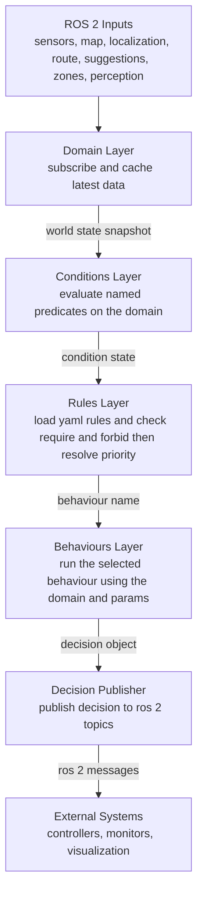

# Decision Maker — Overview & Developer Guide

## High‑level Architecture



- **Domain (`domain.hpp`)** — owns all ROS 2 subscriptions and the “live” world state derived from them (ego state, route info, safety corridor, suggested trajectories, caution zones, timestamps, etc.). It also holds planning adapters/tools and a small amount of internal flags like `sent_assistance_request`.
- **Conditions (`conditions.hpp`)** — a *registry* (`ConditionMap`) of boolean predicates `fn(const Domain&, const ConditionParams&) -> bool`. `evaluate_conditions()` runs every predicate and returns a `ConditionState` (map of `name -> true/false`).
- **Rules (`rules.hpp`)** — declarative mapping from *condition names* to *behaviour names*.
  Rules are loaded from YAML via `load_rules_yaml(path)` and chosen by `choose_behaviour(state, rules)`.
- **Behaviours (`behaviours.hpp`)** — a *registry* (`BehaviourMap`) of behaviour functions that do the heavy lifting: produce a plan/trajectory (or alternative outputs) using the data in `Domain`. Typical entries include `follow_route`, `safety_corridor`, `request_assistance`, `minimum_risk`, etc.
- **DecisionPublisher (`decision_publisher.hpp`)** — wraps the ROS 2 publishers:
  - `trajectory_publisher` (final decision),
  - `trajectory_suggestion_publisher` (soft suggestions),
  - `assistance_publisher`,
  - `traffic_participant_publisher`.
  It exposes `setup(node, topics)` and `publish(Decision)`.
- **DecisionMaker (`decision_maker.hpp/.cpp`)** — the ROS 2 component node that wires everything:
  1. Declares and reads parameters (`DecisionParams`, including `InTopics`/`OutTopics`, timing like `run_delta_time`, and `rules_file`).
  2. `domain.setup(node, params.domain_params, params.in_topics)` to subscribe to inputs.
  3. Builds the registries: `conditions::make_condition_map()` and `behaviours::make_behaviour_map()`.
  4. Loads rules with `rules::load_rules_yaml(rules_file)`.
  5. Starts a periodic timer (period = `run_delta_time`) that executes the **main loop** `run()`.

---

## Main Loop (what happens every tick)

1. **Snapshot** the current `Domain` (updated via subscriptions).
2. **Evaluate Conditions**: `state = evaluate_conditions(domain, params.condition_params, condition_map)`.
3. **Select Behaviour**: `behaviour_name = choose_behaviour(state, rules)` (highest priority matching rule).
4. **Run Behaviour**: Call the registered behaviour function, e.g. `behaviour_map.at(behaviour_name)(domain, params.planning_params)`.
5. **Publish Decision**: `publisher.publish(decision)` (trajectory / suggestion / assistance / participant).

This design keeps logic **data‑driven** (rules YAML) and **open‑ended** (registries for conditions/behaviours).

---

## Parameters & Topics

All parameters are declared in `decision_types.hpp` (and friends). Key groups you can expect:

- **Input topics (`InTopics`)**: suggested trajectory, acceptance, caution zones, perception, map/lanelet sources, etc.
- **Output topics (`OutTopics`)**: trajectory decision, trajectory suggestion, assistance request, traffic participant.
- **Timing**: `run_delta_time` (main loop period).
- **Files**: `rules_file` pointing to a YAML with rule definitions.
- **Per‑module params**: `DomainParams`, `ConditionParams`, `PlanningParams`…

> The exact names are exposed as ROS 2 parameters (e.g., `topic_trajectory_decision`, `topic_trajectory_suggestion`, `topic_assistance_request`, `topic_traffic_participant`, and so on).


## Rules YAML format

The decision rules define when each behaviour should run, based on evaluated conditions.
They are loaded from a YAML file (e.g., rules.yaml) at startup, and can be swapped out or tuned without recompiling.

Each rule entry has:

- name — descriptive label for readability/logging.

- require — list of condition names that must be true for the rule to be eligible.

- forbid — list of condition names that must be false.

- behaviour — the behaviour function to execute when the rule matches.

- priority — numeric value used to break ties (higher = wins if multiple match).

The decision loop evaluates conditions → applies rules top-down by priority → runs the winning behaviour.

## Adding Functionality

You can add new inputs, new conditions, new behaviours, and new rules **without** modifying the decision loop.

### 1) Add a new input (subscription) to `Domain`

1. Extend the state in `Domain` (e.g., add `std::optional<MyMsg>` or a bespoke struct).
2. In `Domain::setup(node, domain_params, in_topics)`, add a subscription:
   ```cpp
   add_subscription<my_msgs::msg::Foo>(
       node, in_topics.foo_topic,
       [this](my_msgs::msg::Foo::SharedPtr msg) {
         this->foo_state = *msg;
       });
   ```
3. If the input needs conversion, add an *adapter* (see existing `adore_dynamics_adapters.hpp` usage).

> Keep subscriptions QoS simple (depth=1) unless you need history; `Domain` is designed to hold the **latest** view.

### 2) Define a new condition

- **Signature:** `bool my_condition(const Domain&, const ConditionParams&)`.
- Register it in `conditions::make_condition_map()`:
  ```cpp
  namespace adore::conditions {
  bool my_condition(const Domain& d, const ConditionParams& p);

  inline ConditionMap make_condition_map() {
    return ConditionMap{
      // existing ones…
      { "my_condition", &my_condition },
    };
  }
  } // namespace adore::conditions
  ```
- Now the condition can be referenced by **name** in the YAML `require`/`forbid` lists.

**Tips** (for deterministic, testable conditions):
- Use only `Domain`’s cached state; avoid direct ROS calls inside a condition.
- Keep conditions *pure* (no side‑effects).
- Return `false` on missing/invalid data; expose separate conditions like `has_foo` for availability.

### 3) Implement a new behaviour

- **Signature:** `Decision my_new_behaviour(const Domain&, const PlanningParams&)` (exact typedef as in `behaviours.hpp`).  
  It should compute one or more of:
  - a final **trajectory** (for `trajectory_publisher`),
  - a **suggested trajectory** (optional),
  - an **assistance request** (optional),
  - a **traffic participant** (optional).

- Register it in `behaviours::make_behaviour_map()`:
  ```cpp
  namespace adore::behaviours {
  Decision my_new_behaviour(const Domain&, const PlanningParams&);

  inline BehaviourMap make_behaviour_map() {
    return BehaviourMap{
      // existing behaviours…
      { "my_new_behaviour", &my_new_behaviour },
    };
  }
  } // namespace adore::behaviours
  ```

- If your behaviour needs a default participant message, reuse the helper:
  ```cpp
  auto participant = behaviours::make_default_participant(domain, planning_params);
  ```

- Behaviours should be **stateless** (preferred). If you need state, store it in `Domain` or a dedicated cache keyed by timestamps from `Domain` to keep the main loop re‑entrant.

### 4) Add or change rules (no C++ changes)

Once the condition and behaviour are registered, reference them in `rules.yaml` and adjust `priority`. No code changes needed in the decision loop.

10. **`time_headway`**
   - Type: `std_msgs::msg::Float64`
   - Description: Received time headway and updates the planner to use this variable time headway.

---

## Publishing & Message Adapters

`DecisionPublisher::setup(node, topics)` initializes publishers using the out‑topic names from parameters. Call `publish(decision)` to emit whatever is populated in the `Decision` (trajectory, suggestions, assistance, participant).

Messages use adapter typedefs defined in `adore_dynamics_adapters.hpp` (e.g., `TrajectoryAdapter`, `ParticipantAdapter`) to decouple the planner from message schemas. See existing behaviours for examples of producing these adapters.

---


## Conventions & Style

- **Naming:** Functions and data members use `snake_case`; classes/structs use `PascalCase`.
- **Modern C++:** Prefer `std::optional`, `std::variant`, `std::chrono`, range‑based loops, and RAII. Avoid raw pointers.
- **Purity:** Conditions are side‑effect free; behaviours publish only via the returned `Decision` (not directly).
- **Determinism:** Tie decisions to `Domain` timestamps to avoid flicker. Use priority to resolve ambiguity.

---

## License

Eclipse Public License 2.0 (EPL‑2.0). See the headers in each file.
